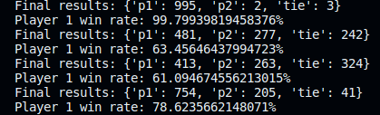

<h1> Rock Paper Scissors Game - ML Python Project</h1>
 
<h2>Features</h2>
<li>Bot that is winning at least 60% of the games in each match</li>
<li>Opponents bot: mrugesh, abbey, quincy, kris</li>
<li>Play interactively against a bot</li>
<li>Play against a bot that plays randomly</li>
<li>Run unit tests automatically</li>
<h2>Acknowledgments</h2>

<b> Python3: http://bit.ly/python3-certifications <b>
 
<b> Machine Learning: https://bit.ly/machine-learning-certification <b>

<h2>Photo</h2>

 

<h2>Links</h2>
<li>FreeCodeCamp Project: https://www.freecodecamp.org/learn/machine-learning-with-python/machine-learning-with-python-projects/rock-paper-scissors</li>
<h2>Contact</h2>

<b> Email: mariusc0023@gmail.com </b>
